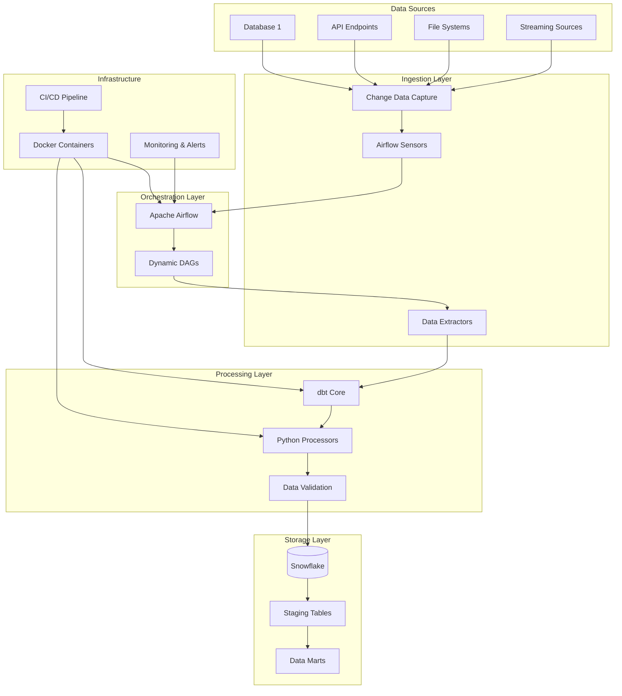
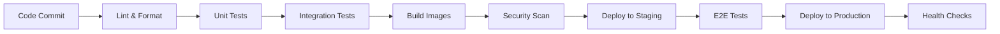

# Design Document

## Overview

The real-time data pipeline is designed as a cloud-native, containerized solution that combines Apache Airflow for orchestration, dbt for data transformation, Snowflake for data warehousing, and Python for custom processing logic. The architecture follows modern data engineering best practices with change data capture (CDC) for efficient processing, comprehensive monitoring, and automated CI/CD deployment.

## Architecture

### High-Level Architecture



### Component Architecture

The system is built using a microservices architecture with the following key components:

1. **Airflow Orchestrator**: Central orchestration engine running in Docker containers
2. **dbt Transformer**: Data transformation engine with version-controlled models
3. **Python Processors**: Custom data processing and validation logic
4. **Snowflake Warehouse**: Cloud data warehouse for storage and analytics
5. **Change Detection System**: CDC mechanisms for efficient data processing
6. **Monitoring Stack**: Comprehensive observability and alerting

## Components and Interfaces

### 1. Data Ingestion Component

**Purpose**: Detect changes in source systems and extract data efficiently

**Key Classes/Modules**:
- `ChangeDetector`: Monitors source systems for data changes
- `DataExtractor`: Extracts data from various source types
- `IngestionValidator`: Validates incoming data quality
- `IngestionMetrics`: Tracks ingestion performance and errors

**Interfaces**:
```python
class DataSource:
    def detect_changes(self) -> List[ChangeEvent]
    def extract_data(self, change_event: ChangeEvent) -> DataFrame
    def validate_schema(self, data: DataFrame) -> ValidationResult

class ChangeEvent:
    source_id: str
    table_name: str
    change_type: str  # INSERT, UPDATE, DELETE
    timestamp: datetime
    affected_rows: int
```

### 2. Orchestration Component

**Purpose**: Manage workflow execution, dependencies, and scheduling

**Key Classes/Modules**:
- `DynamicDAGGenerator`: Creates DAGs based on configuration
- `TaskManager`: Manages task execution and retries
- `DependencyResolver`: Handles inter-task dependencies
- `ScheduleManager`: Manages trigger-based and time-based scheduling

**Interfaces**:
```python
class PipelineDAG:
    def create_ingestion_tasks(self, sources: List[DataSource]) -> List[Task]
    def create_transformation_tasks(self, models: List[str]) -> List[Task]
    def create_validation_tasks(self, tables: List[str]) -> List[Task]
    def set_dependencies(self, task_dependencies: Dict[str, List[str]])

class TaskExecutor:
    def execute_task(self, task: Task) -> TaskResult
    def handle_failure(self, task: Task, error: Exception) -> RetryAction
```

### 3. Transformation Component

**Purpose**: Transform raw data into analytics-ready datasets using dbt

**Key Classes/Modules**:
- `dbtRunner`: Executes dbt models and tests
- `ModelManager`: Manages dbt model lifecycle
- `TestRunner`: Executes data quality tests
- `LineageTracker`: Tracks data lineage and dependencies

**Interfaces**:
```python
class dbtExecutor:
    def run_models(self, models: List[str], target: str) -> dbtResult
    def test_models(self, models: List[str]) -> TestResult
    def generate_docs(self) -> DocumentationResult
    def get_lineage(self) -> LineageGraph

class TransformationConfig:
    models_path: str
    target_schema: str
    test_severity: str
    documentation_enabled: bool
```

### 4. Storage Component

**Purpose**: Manage data storage, loading, and optimization in Snowflake

**Key Classes/Modules**:
- `SnowflakeConnector`: Manages Snowflake connections and sessions
- `DataLoader`: Handles bulk data loading operations
- `SchemaManager`: Manages table schemas and DDL operations
- `PerformanceOptimizer`: Optimizes queries and storage

**Interfaces**:
```python
class SnowflakeManager:
    def create_connection(self, config: SnowflakeConfig) -> Connection
    def bulk_load(self, data: DataFrame, table: str, mode: str) -> LoadResult
    def execute_query(self, query: str) -> QueryResult
    def optimize_table(self, table: str) -> OptimizationResult

class DataWarehouse:
    def create_schema(self, schema_name: str) -> bool
    def manage_retention(self, table: str, retention_days: int) -> bool
    def get_table_stats(self, table: str) -> TableStats
```

## Data Models

### Core Data Models

```python
@dataclass
class PipelineConfig:
    name: str
    sources: List[DataSourceConfig]
    transformations: List[TransformationConfig]
    targets: List[TargetConfig]
    schedule: ScheduleConfig
    monitoring: MonitoringConfig

@dataclass
class DataSourceConfig:
    source_id: str
    source_type: str  # database, api, file, stream
    connection_params: Dict[str, Any]
    change_detection: ChangeDetectionConfig
    extraction_config: ExtractionConfig

@dataclass
class TransformationConfig:
    model_name: str
    model_type: str  # staging, intermediate, mart
    dependencies: List[str]
    tests: List[TestConfig]
    materialization: str  # table, view, incremental

@dataclass
class ChangeDetectionConfig:
    method: str  # timestamp, log_based, trigger_based
    check_interval: int
    batch_size: int
    watermark_column: str
```

### Metadata Models

```python
@dataclass
class PipelineRun:
    run_id: str
    pipeline_name: str
    start_time: datetime
    end_time: Optional[datetime]
    status: str  # running, success, failed
    metrics: RunMetrics

@dataclass
class TaskExecution:
    task_id: str
    run_id: str
    start_time: datetime
    end_time: Optional[datetime]
    status: str
    error_message: Optional[str]
    retry_count: int

@dataclass
class DataQualityResult:
    table_name: str
    test_name: str
    result: str  # pass, warn, fail
    row_count: int
    failed_rows: int
    execution_time: datetime
```

## Error Handling

### Error Classification

1. **Transient Errors**: Network timeouts, temporary resource unavailability
   - Strategy: Exponential backoff retry with jitter
   - Max retries: 3
   - Backoff: 2^attempt * base_delay + random_jitter

2. **Data Quality Errors**: Schema mismatches, constraint violations
   - Strategy: Quarantine bad data, alert data stewards
   - Continue processing valid records
   - Generate data quality reports

3. **System Errors**: Infrastructure failures, service unavailability
   - Strategy: Circuit breaker pattern
   - Failover to backup systems where possible
   - Immediate alerting for critical failures

4. **Configuration Errors**: Invalid configurations, missing credentials
   - Strategy: Fail fast with clear error messages
   - Prevent pipeline startup with invalid configs
   - Provide configuration validation tools

### Error Recovery Mechanisms

```python
class ErrorHandler:
    def handle_ingestion_error(self, error: IngestionError) -> RecoveryAction
    def handle_transformation_error(self, error: TransformationError) -> RecoveryAction
    def handle_loading_error(self, error: LoadingError) -> RecoveryAction
    def quarantine_data(self, data: DataFrame, reason: str) -> QuarantineResult

class CircuitBreaker:
    def __init__(self, failure_threshold: int, recovery_timeout: int)
    def call(self, func: Callable) -> Any
    def is_open(self) -> bool
    def reset(self) -> None
```

## Testing Strategy

### 1. Unit Testing
- **Coverage Target**: 80% minimum
- **Framework**: pytest with fixtures for database connections
- **Scope**: Individual functions, data transformations, utility methods
- **Mock Strategy**: Mock external dependencies (Snowflake, APIs)

### 2. Integration Testing
- **Framework**: pytest with testcontainers for database testing
- **Scope**: End-to-end data flow, component interactions
- **Test Data**: Synthetic datasets with known expected outcomes
- **Environment**: Isolated test environment with test databases

### 3. Data Quality Testing
- **Framework**: dbt tests + custom Python validators
- **Types**: Schema validation, referential integrity, business rule validation
- **Automation**: Integrated into CI/CD pipeline
- **Reporting**: Automated data quality dashboards

### 4. Performance Testing
- **Framework**: pytest-benchmark + custom performance monitors
- **Metrics**: Throughput, latency, resource utilization
- **Load Testing**: Simulate high-volume data scenarios
- **Benchmarking**: Track performance trends over time

### Test Structure
```
tests/
├── unit/
│   ├── test_extractors.py
│   ├── test_transformers.py
│   └── test_loaders.py
├── integration/
│   ├── test_end_to_end.py
│   ├── test_airflow_dags.py
│   └── test_dbt_models.py
├── data_quality/
│   ├── test_data_validation.py
│   └── test_business_rules.py
└── performance/
    ├── test_throughput.py
    └── test_scalability.py
```

## Deployment Architecture

### Container Strategy
- **Base Images**: Official Python, Airflow, and dbt images
- **Multi-stage Builds**: Separate build and runtime stages
- **Security**: Non-root users, minimal attack surface
- **Optimization**: Layer caching, minimal image sizes

### Infrastructure as Code
- **Tool**: Docker Compose for local development, Kubernetes for production
- **Configuration Management**: Environment-specific config files
- **Secrets Management**: External secret stores (AWS Secrets Manager, etc.)
- **Networking**: Service mesh for inter-service communication

### CI/CD Pipeline


### Monitoring and Observability

1. **Metrics Collection**:
   - Pipeline execution metrics
   - Data quality metrics
   - System performance metrics
   - Business KPIs

2. **Logging Strategy**:
   - Structured logging (JSON format)
   - Centralized log aggregation
   - Log retention policies
   - Sensitive data masking

3. **Alerting Rules**:
   - Pipeline failures
   - Data quality degradation
   - Performance threshold breaches
   - System resource exhaustion

4. **Dashboards**:
   - Pipeline health overview
   - Data quality trends
   - Performance metrics
   - Cost optimization insights