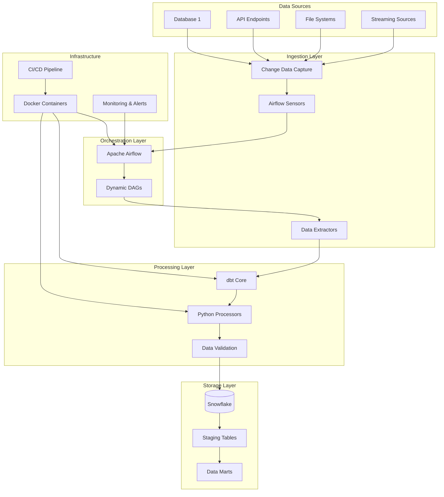

# Real-time Data Pipeline

A comprehensive real-time, end-to-end data pipeline that enables scalable data ingestion, transformation, and orchestration for analytics use cases.

## Architecture

### High-Level Architecture



The pipeline is built using a microservices architecture with the following key components:

1. **Airflow Orchestrator**: Central orchestration engine running in Docker containers
2. **dbt Transformer**: Data transformation engine with version-controlled models
3. **Python Processors**: Custom data processing and validation logic
4. **Snowflake Warehouse**: Cloud data warehouse for storage and analytics
5. **Change Detection System**: CDC mechanisms for efficient data processing
6. **Monitoring Stack**: Comprehensive observability and alerting

## Project Structure

```
├── src/                    # Main source code
│   ├── config/            # Configuration management
│   ├── ingestion/         # Data ingestion components
│   ├── interfaces/        # Base classes and interfaces
│   ├── orchestration/     # Airflow orchestration components
│   ├── storage/           # Snowflake storage components
│   └── utils/             # Utility functions and helpers
├── tests/                 # Test suites
│   ├── unit/             # Unit tests
│   └── integration/      # Integration tests
├── config/               # Configuration files
│   ├── base.yaml         # Base configuration
│   ├── development.yaml  # Development environment
│   └── production.yaml   # Production environment
├── docker/               # Docker configurations
├── dbt/                  # dbt project files
├── airflow/              # Airflow DAGs and configurations
└── requirements.txt      # Python dependencies
```

## Configuration

The pipeline uses environment-specific YAML configuration files:

- `config/base.yaml` - Base configuration shared across environments
- `config/development.yaml` - Development environment overrides
- `config/production.yaml` - Production environment overrides

Set the `PIPELINE_ENV` environment variable to specify the environment (defaults to "development").

## Environment Variables

Key environment variables for production:

- `PIPELINE_ENV` - Environment name (development, production)
- `SNOWFLAKE_ACCOUNT` - Snowflake account identifier
- `SNOWFLAKE_USERNAME` - Snowflake username
- `SNOWFLAKE_PASSWORD` - Snowflake password
- `AIRFLOW_BASE_URL` - Airflow web server URL
- `LOG_LEVEL` - Logging level (DEBUG, INFO, WARNING, ERROR)

## Getting Started

1. Install dependencies:
   ```bash
   pip install -r requirements.txt
   ```

2. Configure your environment:
   ```bash
   export PIPELINE_ENV=development
   ```

3. Update configuration files in the `config/` directory with your specific settings.

## Logging

The pipeline uses structured JSON logging with configurable output to console and files. Logs include contextual information for debugging and monitoring.

## Architecture

The pipeline follows a modular architecture with clear separation of concerns:

- **Ingestion Layer**: Handles data extraction and change detection
- **Orchestration Layer**: Manages workflow execution with Airflow
- **Transformation Layer**: Processes data using dbt
- **Storage Layer**: Manages data loading to Snowflake
- **Configuration Layer**: Handles environment-specific settings
- **Monitoring Layer**: Provides logging and observability